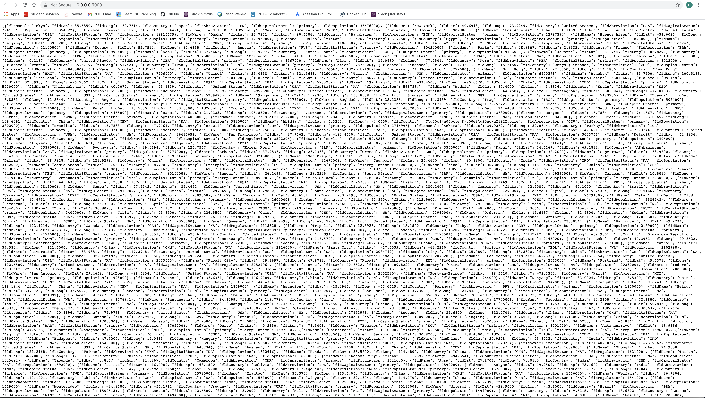
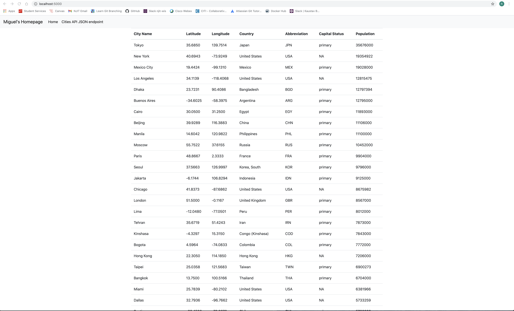
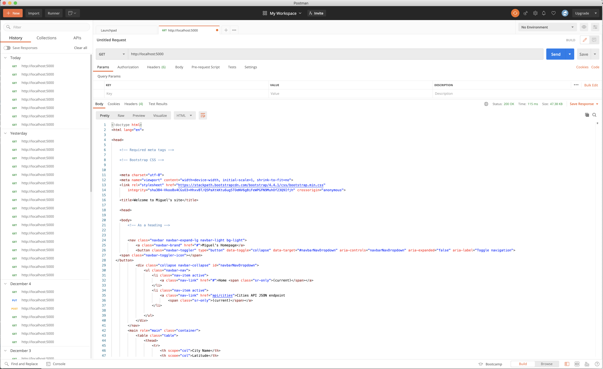

# IS601 Web Systems Development

## Project Description
**Homework: Web Application Part 1**

This project is a homework assignment to learn and demonstrate hot to get Pycharm setup with Docker, Flask, MySQL and GitHub.

## MySQL Screenshot

## Postman Screenshot

## Localhost Screenshot

**Homework: Web Application Part 2**

## Webpage Screenshot

## Layout Screenshot

**Homework: Web Application Part 3**

## Assignment Document

